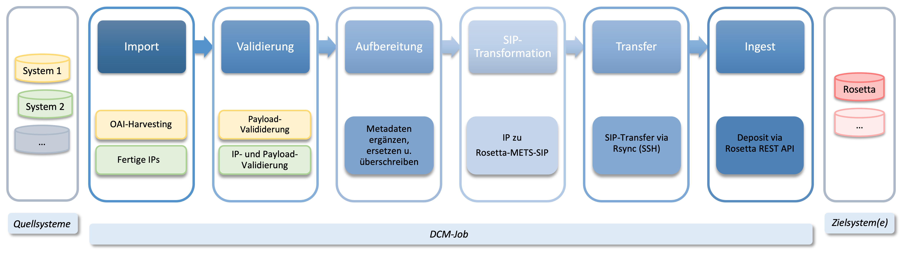

# Einleitung

Der Digital Curation Manager (DCM) ermöglicht es Datenkurator:innen, digitale Objekte aus Quellsystemen auszuwählen, aufzubereiten und in ein Langzeitarchivsystem[^1] zu überführen.

Die Anwendung fungiert im Kern als Submission-Application und verknüpft mehrere Teilprozesse zu einem automatisierten Verarbeitungsworkflow. Dabei unterstützt der DCM sowohl Datenabfragen über Schnittstellen und automatische Dateidownloads als auch die Verarbeitung extern kuratierter und bereitgestellter Information Packages.

Der DCM schafft transparente und konsistente Abläufe. Die integrierte Weboberfläche führt alle Konfigurations- und Statusinformationen zentral zusammen und erleichtert die Orientierung im gesamten Workflow.

[^1]: Derzeit wird ExLibris Rosetta unterstüzt; weitere Systeme sind geplant.
